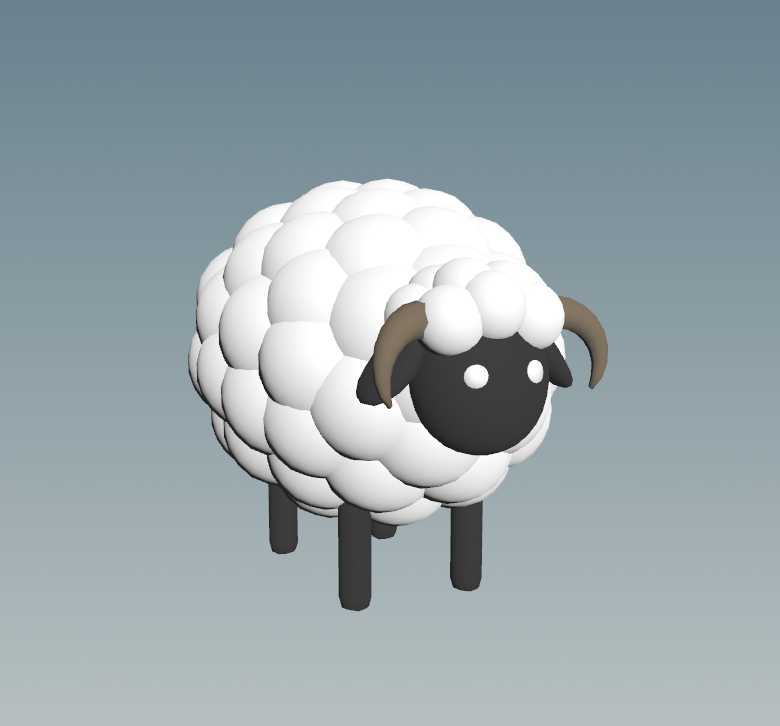
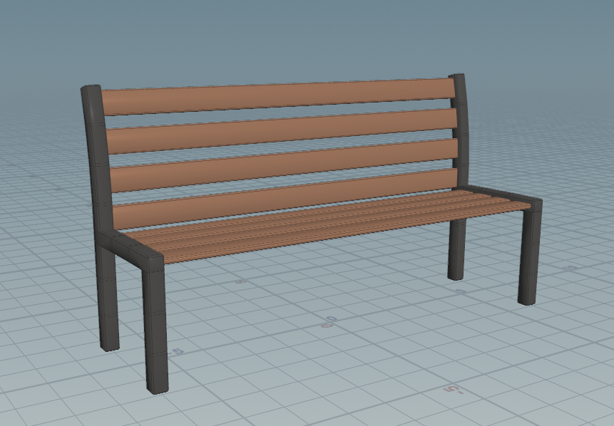
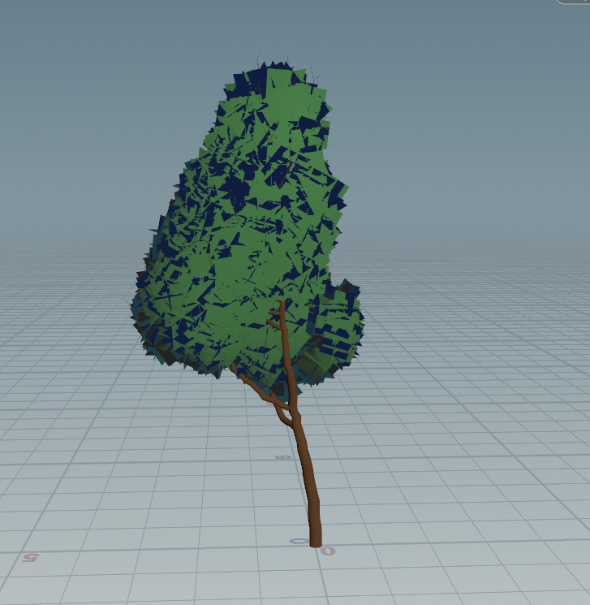
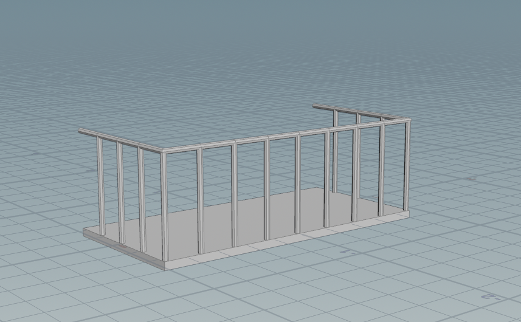
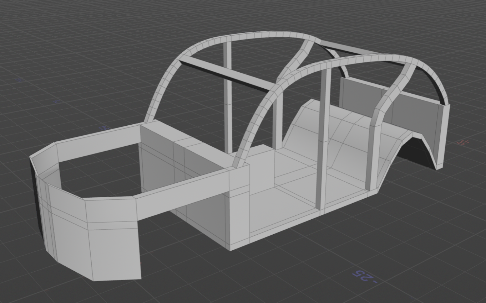
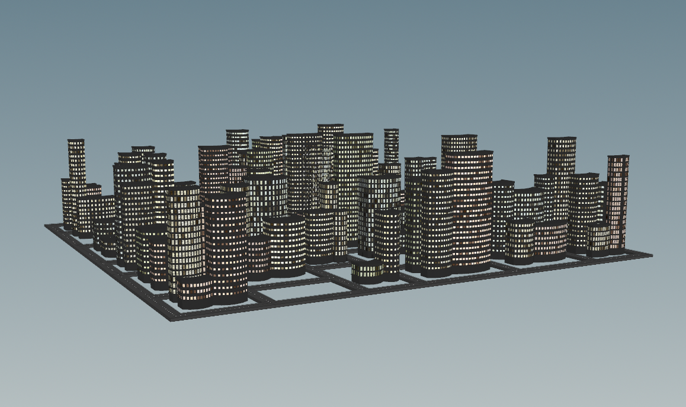
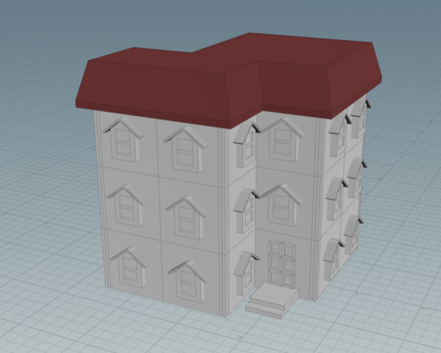
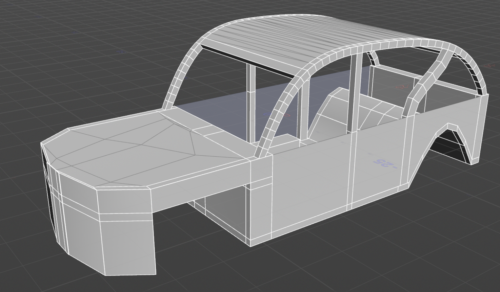
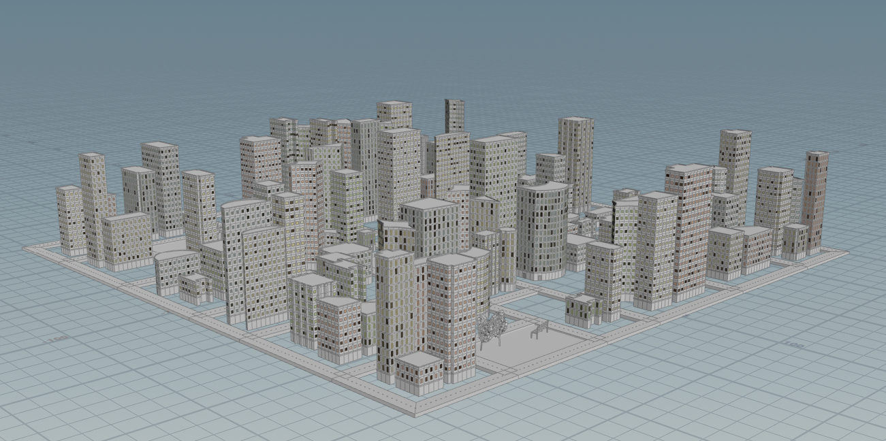

# Final Project Results!

## Project planning: Design Doc (due 11/5)
### Design Doc
#### Introduction
- We are motivated to make an immersive experience within a surreal procedural city.

#### Goal
- We intend to build a stylized Unity driving game featuring real-time procedural city generation, procedural cars, etc.

#### Inspiration/reference:
- Some of our reference projects include slowroads.io & the game easy delivery co.
- Our reference artwork (for style inspiration) is as follows: & our Pinterest board: https://pin.it/70blAtfEj 

|  |  |  |
| :--: | :--: | :--: | 

#### Specification:
- The main features of our project is the procedural city with weirdness parameter, procedural cards, driving, post-process effects

#### Techniques:
- We will be using Unity & Houdini. 

#### Design:
- Simple free-body diagram illustrating how our program will fit together:

#### Timeline:
- Create a week-by-week set of milestones for each person in your group. Make sure you explicitly outline what each group member's duties will be.

# Milestone 1: 
## Alice: Procedural City Assets (building, benches, trees, sheep)
### Procedural Sheep

### Procedural Benches

### Procedural Trees & Balcony
I followed this tree tutorial: https://www.sidefx.com/tutorials/procedural-stylized-trees-with-houdini-and-ue4/

  
   

## Jimin: Procedural City Assets (building, poles, lights)
### Lampposts and Poles

## Christopher: Procedural Car Skeleton
I researched car generators and did not really find any. Therefore, I planned out the overall car design myself and created a procedural skeleton for my car. 

## Progress:
We did not get as much done the first milestone as we hoped, as we spent a lot of time discussing ideas. Creating this number of procedural city assets proved to be more time consuming than expected. For the procedural car, it was hard to get started since there are not many resources online on procedural car generation. 

# Milestone 2:
## Alice: Putting city together
Finished procedural building not done in the last milestone:

### Procedural Building

### Procedural City
I did the roads and varied the buildings. I heavily used the "Labs Lot Subdivision" node. 
I used this city as a reference: https://www.artstation.com/artwork/kQ3wgn

## Jimin: 
Finished procedural building and additional assets not done in the last milestone:

### Procedural Building 

## Christopher: Procedural Car Exterior
I built upon my car skeleton and created the exterior from some of the openings left by the skeleton. Creating the side faces from the edges proved to be harder than I though initially as I had to account for the change in the edge numbering due to changing some of the parameters such as the front/back windows and the rear door top parameters.   

  
   

## Progress:
We made relatively good progress for this milestone. While we did not fully put together the city at this point, we have all the individual assets done. The car is coming along. 

# Milestone 3 (Final):
## Alice: Polish up city + Unity 
When we tried to import the city into Unity, we realized that the city had way too many primitives (around 10 million). I had to reduce the city to around 150k primitives to get it to load into Unity. I added parks with trees and benches, reduced the polycount, and also had to remake all my materials into unity materials (which made them default grey in houdini). I did a lot of debugging. 

## Jimin: Polish up city + Unity + Houdini Engine
I added the sidewalks, which include two different types of lampposts and sheep. I imported the HDAs into Unity. I did a lot of debugging. Alice and I worked together to do the city chunking and driving in Unity. 

## Christopher: Procedural Car Interior

# Overall Thoughts:
Our initial project scope was too large, and we spent a lot of time trying to fix HDA/Houdini Engine issues; getting our assets from Houdini to Unity took a lot more work than we expected. We did accomplish our main goals of creating a driving game with a procedurally generated city and cars. We created all the assets ourselves! We unfortunately did not have enough time to make a weirdness parameter for our city. With more time, we definitely could have implemented that and polished up our game more. 

## Milestone 1: Implementation part 1 (due 11/12)
Begin implementing your engine! Don't worry too much about polish or parameter tuning -- this week is about getting together the bulk of your generator implemented. By the end of the week, even if your visuals are crude, the majority of your generator's functionality should be done.

Put all your code in your forked repository.

Submission: Add a new section to your README titled: Milestone #1, which should include
- written description of progress on your project goals. If you haven't hit all your goals, what's giving you trouble?
- Examples of your generators output so far
We'll check your repository for updates. No need to create a new pull request.
## Milestone 2: Implementation part 2 (due 11/24)
We're over halfway there! This week should be about fixing bugs and extending the core of your generator. Make sure by the end of this week _your generator works and is feature complete._ Any core engine features that don't make it in this week should be cut! Don't worry if you haven't managed to exactly hit your goals. We're more interested in seeing proof of your development effort than knowing your planned everything perfectly. 

Put all your code in your forked repository.

Submission: Add a new section to your README titled: Milestone #3, which should include
- written description of progress on your project goals. If you haven't hit all your goals, what did you have to cut and why? 
- Detailed output from your generator, images, video, etc.
We'll check your repository for updates. No need to create a new pull request.

Come to class on the due date with a WORKING COPY of your project. We'll be spending time in class critiquing and reviewing your work so far.

Submission:
- Push all your code / files to your repository
- Come to class ready to present your finished project
- Update your README with two sections 
  - final results with images and a live demo if possible
  - post mortem: how did your project go overall? Did you accomplish your goals? Did you have to pivot?
